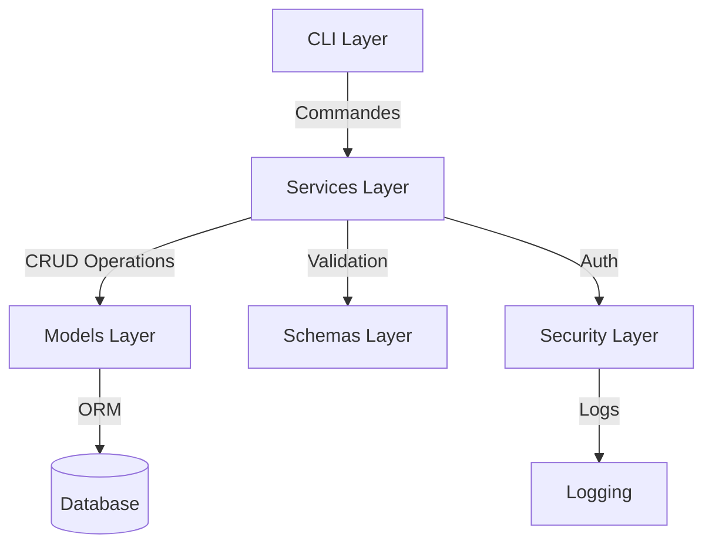
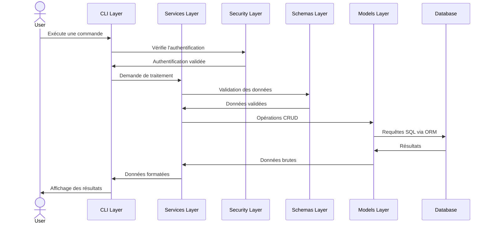

# Architecture et Structure du Projet

## Vue d'ensemble

L'architecture du CRM Epic Events est conçue pour être modulaire, maintenable et sécurisée. Elle suit le principe de la séparation des préoccupations en divisant le système en différentes couches logiques.

## Architecture globale



## Structure des répertoires

Le projet est organisé selon la structure suivante :

```
crm_epic_events/
├── .env.example               # Exemple de configuration des variables d'environnement
├── .gitignore                 # Fichiers à ignorer par Git
├── README.md                  # Documentation du projet
├── requirements.txt           # Dépendances du projet
├── setup.py                   # Configuration du package
├── conftest.py                # Configuration des tests pytest
├── crm/
│   ├── __init__.py
│   ├── config.py              # Configuration de l'application
│   ├── models/                # Modèles SQLAlchemy
│   │   ├── __init__.py
│   │   ├── base.py           # Classe de base pour les modèles
│   │   ├── user.py           # Modèle utilisateur
│   │   ├── client.py         # Modèle client
│   │   ├── contract.py       # Modèle contrat
│   │   └── event.py          # Modèle événement
│   ├── database.py            # Configuration SQLAlchemy
│   ├── schemas/               # Schémas Pydantic
│   │   ├── __init__.py
│   │   ├── user.py
│   │   ├── client.py
│   │   ├── contract.py
│   │   └── event.py
│   ├── services/              # Logique métier
│   │   ├── __init__.py
│   │   ├── auth.py
│   │   ├── client.py
│   │   ├── contract.py
│   │   └── event.py
│   ├── security/              # Fonctions de sécurité
│   │   ├── __init__.py
│   │   ├── auth.py           # Authentification
│   │   └── permissions.py     # Système de permissions
│   └── utils/                 # Utilitaires
│       ├── __init__.py
│       ├── logging.py         # Configuration de Loguru et Sentry
│       └── helpers.py         # Fonctions d'aide générales
├── cli/                       # Interface en ligne de commande
│   ├── __init__.py
│   ├── main.py                # Point d'entrée CLI (avec Typer)
│   ├── commands/              # Commandes de la CLI
│   │   ├── __init__.py
│   │   ├── auth_commands.py
│   │   ├── client_commands.py
│   │   ├── contract_commands.py
│   │   └── event_commands.py
│   └── formatters/            # Formatage des sorties avec Rich
│       ├── __init__.py
│       ├── tables.py
│       └── styles.py
└── tests/                     # Tests
    ├── __init__.py
    ├── conftest.py            # Configuration des fixtures
    ├── unit/                  # Tests unitaires
    └── integration/           # Tests d'intégration
```

## Description des composants

### 1. Couche de modèles (Models Layer)

Cette couche contient les modèles SQLAlchemy qui représentent les tables de la base de données et leurs relations.

- `base.py` : Définit la classe de base pour tous les modèles
- `user.py` : Modèle pour les utilisateurs du système avec leurs rôles
- `client.py` : Modèle pour les clients d'Epic Events
- `contract.py` : Modèle pour les contrats associés aux clients
- `event.py` : Modèle pour les événements liés aux contrats

### 2. Couche de schémas (Schemas Layer)

Les schémas Pydantic définissent comment les données doivent être validées lors de leur entrée et de leur sortie du système.

- `user.py` : Schémas pour la validation des données utilisateur
- `client.py` : Schémas pour la validation des données client
- `contract.py` : Schémas pour la validation des données de contrat
- `event.py` : Schémas pour la validation des données d'événement

### 3. Couche de services (Services Layer)

Cette couche contient la logique métier de l'application et sert d'intermédiaire entre l'interface utilisateur et les modèles.

- `auth.py` : Services liés à l'authentification et à l'autorisation
- `client.py` : Services pour la gestion des clients
- `contract.py` : Services pour la gestion des contrats
- `event.py` : Services pour la gestion des événements

### 4. Couche de sécurité (Security Layer)

Gère l'authentification, l'autorisation et la sécurité globale de l'application.

- `auth.py` : Fonctions d'authentification avec JWT
- `permissions.py` : Système de permissions basé sur les rôles

### 5. Interface utilisateur (CLI Layer)

L'interface en ligne de commande qui permet aux utilisateurs d'interagir avec le système.

- `main.py` : Point d'entrée de l'application CLI
- `commands/` : Implémentation des différentes commandes
- `formatters/` : Mise en forme des sorties pour une meilleure lisibilité

### 6. Utilitaires (Utils)

Fonctions et classes utilitaires utilisées dans toute l'application.

- `logging.py` : Configuration de la journalisation avec Sentry et Loguru
- `helpers.py` : Fonctions d'aide diverses

## Flux de données



## Principes architecturaux

1. **Séparation des préoccupations** : Chaque composant a une responsabilité unique et bien définie.
2. **Dépendance unidirectionnelle** : Les couches supérieures dépendent des couches inférieures, mais pas l'inverse.
3. **Abstraction de la base de données** : L'ORM permet d'interagir avec la base de données sans écrire de SQL directement.
4. **Validation des données** : Les schémas Pydantic assurent la validation des données avant leur traitement.
5. **Sécurité intégrée** : L'authentification et l'autorisation sont vérifiées à chaque opération sensible.
