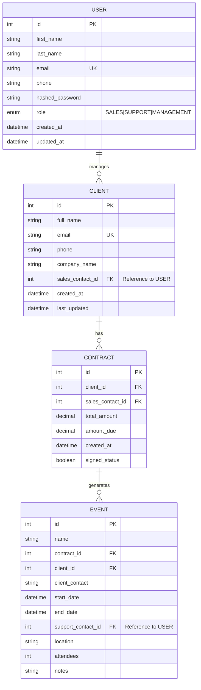

# Modélisation des données

## Schéma de la base de données

La modélisation des données est au cœur du CRM Epic Events. Quatre entités principales structurent la base de données : Utilisateurs, Clients, Contrats et Événements.



## Description détaillée des entités

### Entité USER (Utilisateur)

Représente les employés d'Epic Events répartis dans trois départements.

| Attribut         | Type        | Description                                   | Contraintes               |
|------------------|-------------|-----------------------------------------------|---------------------------|
| id               | Integer     | Identifiant unique                            | Clé primaire              |
| first_name       | String      | Prénom de l'utilisateur                       | Non nul                   |
| last_name        | String      | Nom de famille de l'utilisateur               | Non nul                   |
| email            | String      | Adresse email professionnelle                 | Unique, Non nul           |
| phone            | String      | Numéro de téléphone                           | -                         |
| hashed_password  | String      | Mot de passe haché avec sel                   | Non nul                   |
| role             | Enum        | Rôle (Commercial, Support, Management)        | Non nul                   |
| created_at       | DateTime    | Date de création du compte                    | Non nul, Défaut=now()     |
| updated_at       | DateTime    | Date de dernière modification                 | Non nul, Défaut=now()     |

### Entité CLIENT

Représente les clients d'Epic Events.

| Attribut         | Type        | Description                                   | Contraintes               |
|------------------|-------------|-----------------------------------------------|---------------------------|
| id               | Integer     | Identifiant unique                            | Clé primaire              |
| full_name        | String      | Nom complet du client                         | Non nul                   |
| email            | String      | Adresse email du client                       | Unique, Non nul           |
| phone            | String      | Numéro de téléphone du client                 | Non nul                   |
| company_name     | String      | Nom de l'entreprise du client                 | Non nul                   |
| sales_contact_id | Integer     | ID du commercial responsable                  | Clé étrangère (USER)      |
| created_at       | DateTime    | Date de création du client                    | Non nul, Défaut=now()     |
| last_updated     | DateTime    | Date de dernière mise à jour                  | Non nul, Défaut=now()     |

### Entité CONTRACT (Contrat)

Représente les contrats conclus avec les clients.

| Attribut         | Type        | Description                                   | Contraintes               |
|------------------|-------------|-----------------------------------------------|---------------------------|
| id               | Integer     | Identifiant unique                            | Clé primaire              |
| client_id        | Integer     | ID du client associé                          | Clé étrangère (CLIENT)    |
| sales_contact_id | Integer     | ID du commercial responsable                  | Clé étrangère (USER)      |
| total_amount     | Decimal     | Montant total du contrat                      | Non nul                   |
| amount_due       | Decimal     | Montant restant à payer                       | Non nul                   |
| created_at       | DateTime    | Date de création du contrat                   | Non nul, Défaut=now()     |
| signed_status    | Boolean     | Statut de signature (signé ou non)            | Non nul, Défaut=False     |

### Entité EVENT (Événement)

Représente les événements organisés dans le cadre des contrats.

| Attribut         | Type        | Description                                   | Contraintes               |
|------------------|-------------|-----------------------------------------------|---------------------------|
| id               | Integer     | Identifiant unique                            | Clé primaire              |
| name             | String      | Nom de l'événement                            | Non nul                   |
| contract_id      | Integer     | ID du contrat associé                         | Clé étrangère (CONTRACT)  |
| client_id        | Integer     | ID du client associé                          | Clé étrangère (CLIENT)    |
| client_contact   | String      | Informations de contact du client             | Non nul                   |
| start_date       | DateTime    | Date et heure de début                        | Non nul                   |
| end_date         | DateTime    | Date et heure de fin                          | Non nul                   |
| support_contact_id| Integer    | ID du membre du support responsable           | Clé étrangère (USER)      |
| location         | String      | Lieu de l'événement                           | Non nul                   |
| attendees        | Integer     | Nombre de participants                        | Non nul                   |
| notes            | Text        | Notes et détails sur l'événement              | -                         |

## Relations

### Utilisateur (USER) -> Client (CLIENT)
- Relation : Un-à-plusieurs
- Description : Un commercial (utilisateur) peut gérer plusieurs clients, mais un client n'est géré que par un seul commercial.
- Contrainte : Le commercial doit avoir le rôle "SALES".

### Client (CLIENT) -> Contrat (CONTRACT)
- Relation : Un-à-plusieurs
- Description : Un client peut avoir plusieurs contrats, mais un contrat n'appartient qu'à un seul client.

### Contrat (CONTRACT) -> Événement (EVENT)
- Relation : Un-à-plusieurs
- Description : Un contrat peut générer plusieurs événements, mais un événement n'est associé qu'à un seul contrat.

### Utilisateur (USER) -> Événement (EVENT)
- Relation : Un-à-plusieurs
- Description : Un membre du support peut être responsable de plusieurs événements, mais un événement n'est géré que par un seul membre du support.
- Contrainte : Le membre du support doit avoir le rôle "SUPPORT".

## Règles métier

1. Un client est toujours associé à un commercial (rôle "SALES").
2. Un événement ne peut être créé que si le contrat associé est signé (`signed_status = True`).
3. Seul un utilisateur avec le rôle "MANAGEMENT" peut créer ou modifier des utilisateurs.
4. Un commercial ne peut modifier que les clients dont il est responsable.
5. Un membre du support ne peut modifier que les événements dont il est responsable.
6. Tout utilisateur peut consulter tous les clients, contrats et événements (lecture seule).

## Conception de la base de données

### Indices et optimisations

Pour optimiser les performances de la base de données, les indices suivants sont recommandés :

1. Indice sur `USER.email` pour des recherches rapides lors de l'authentification
2. Indice sur `CLIENT.sales_contact_id` pour filtrer les clients par commercial
3. Indice sur `CONTRACT.client_id` pour afficher rapidement les contrats d'un client
4. Indice sur `EVENT.support_contact_id` pour filtrer les événements par membre du support
5. Indice sur `EVENT.contract_id` pour lier rapidement les événements à leurs contrats

### Migrations

Les migrations de la base de données sont gérées via Alembic (intégré à SQLAlchemy) pour permettre des évolutions contrôlées du schéma de base de données.

## Initialisation de la base de données

L'initialisation de la base de données comprend :

1. La création des tables
2. La création d'un utilisateur administratif initial (rôle "MANAGEMENT")
3. La mise en place des contraintes de clé étrangère

## Code d'implémentation

### Définition de la classe de base

```python
# crm/models/base.py
from sqlalchemy.ext.declarative import declarative_base
from sqlalchemy import Column, Integer, DateTime
from sqlalchemy.sql import func

Base = declarative_base()

class BaseModel(Base):
    __abstract__ = True
    
    id = Column(Integer, primary_key=True, autoincrement=True)
    created_at = Column(DateTime, default=func.now(), nullable=False)
```

### Implémentation du modèle USER

```python
# crm/models/user.py
from sqlalchemy import Column, String, Enum, DateTime
from sqlalchemy.sql import func
from sqlalchemy.orm import relationship
from .base import BaseModel

class User(BaseModel):
    __tablename__ = "users"
    
    first_name = Column(String(50), nullable=False)
    last_name = Column(String(50), nullable=False)
    email = Column(String(100), unique=True, nullable=False)
    phone = Column(String(20))
    hashed_password = Column(String(100), nullable=False)
    role = Column(Enum("SALES", "SUPPORT", "MANAGEMENT", name="user_roles"), nullable=False)
    updated_at = Column(DateTime, default=func.now(), onupdate=func.now(), nullable=False)
    
    # Relations
    clients = relationship("Client", back_populates="sales_contact")
    events = relationship("Event", back_populates="support_contact")
```
