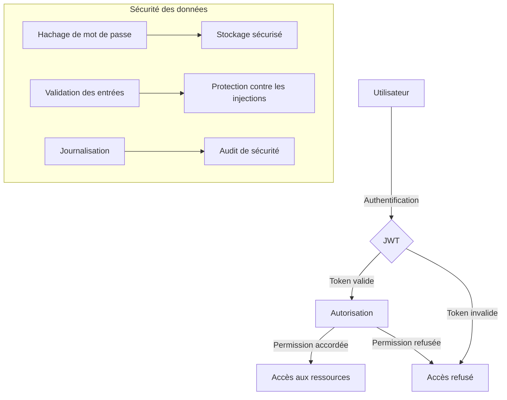
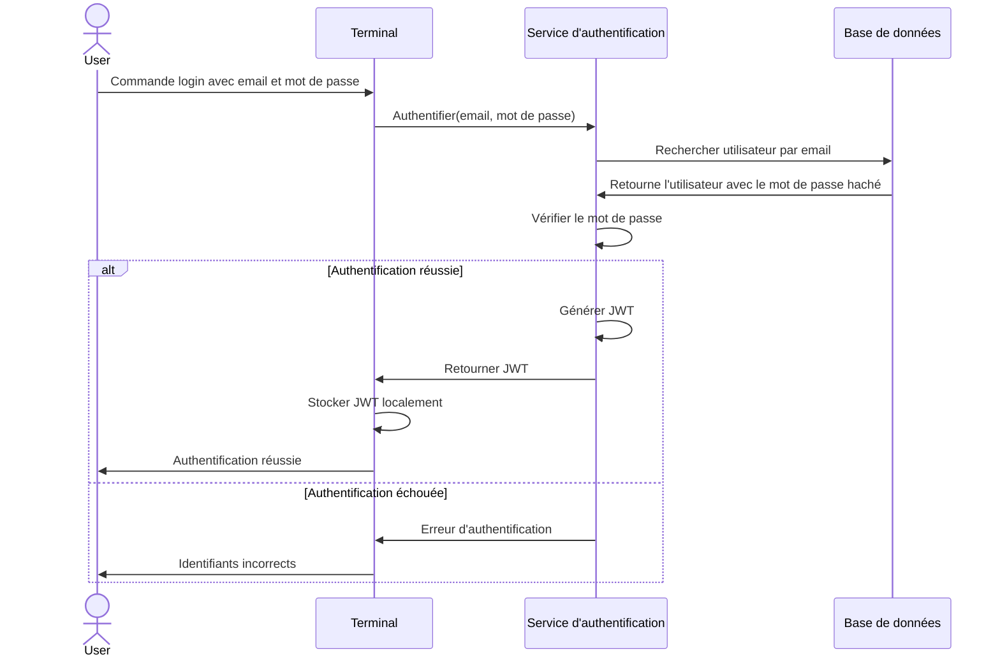
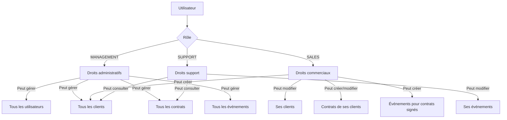

# Sécurité et Authentification

La sécurité est un aspect primordial du CRM Epic Events, car le système manipule des données sensibles concernant les clients, les contrats et les événements. Cette documentation détaille l'architecture de sécurité mise en place pour protéger ces données.

## Architecture de sécurité



## Authentification des utilisateurs

### Processus d'authentification



### Stockage des mots de passe

Les mots de passe sont protégés à l'aide de la bibliothèque Passlib avec l'algorithme bcrypt :

1. **Hachage** : Les mots de passe sont hachés avec bcrypt, un algorithme spécialement conçu pour le hachage de mots de passe.
2. **Salage** : Chaque mot de passe est salé avec un sel unique pour prévenir les attaques par tables arc-en-ciel.
3. **Facteur de travail** : Un facteur de travail élevé est configuré pour rendre les attaques par force brute plus difficiles.

```python
# crm/security/auth.py
from passlib.context import CryptContext

# Configuration du contexte de hachage
pwd_context = CryptContext(schemes=["bcrypt"], deprecated="auto")

def hash_password(password: str) -> str:
    """Hache un mot de passe en texte brut"""
    return pwd_context.hash(password)

def verify_password(plain_password: str, hashed_password: str) -> bool:
    """Vérifie qu'un mot de passe correspond à sa version hachée"""
    return pwd_context.verify(plain_password, hashed_password)
```

## Gestion des tokens avec JWT

### Création et validation des tokens

Les JSON Web Tokens (JWT) sont utilisés pour maintenir les sessions et authentifier les requêtes après la connexion initiale :

1. **Génération de token** : Après authentification, un JWT est généré avec une durée de validité limitée.
2. **Structure du token** : Le token contient l'ID de l'utilisateur, son rôle et sa date d'expiration.
3. **Validation** : Chaque commande vérifie le token pour authentifier l'utilisateur.

```python
# crm/security/auth.py
import jwt
from datetime import datetime, timedelta
from typing import Dict, Optional

# Configuration
SECRET_KEY = "SECRET_KEY_FROM_ENV_VAR"  # À charger depuis les variables d'environnement
ALGORITHM = "HS256"
ACCESS_TOKEN_EXPIRE_MINUTES = 60 * 24  # 24 heures

def create_access_token(data: Dict, expires_delta: Optional[timedelta] = None) -> str:
    """Crée un JWT avec les données spécifiées et une date d'expiration"""
    to_encode = data.copy()
    expire = datetime.utcnow() + (expires_delta or timedelta(minutes=ACCESS_TOKEN_EXPIRE_MINUTES))
    to_encode.update({"exp": expire})
    encoded_jwt = jwt.encode(to_encode, SECRET_KEY, algorithm=ALGORITHM)
    return encoded_jwt

def decode_token(token: str) -> Dict:
    """Décode un JWT et retourne ses données"""
    try:
        payload = jwt.decode(token, SECRET_KEY, algorithms=[ALGORITHM])
        return payload
    except jwt.PyJWTError:
        raise Exception("Token invalide")
```

### Stockage local des tokens

Pour maintenir la session utilisateur dans l'application CLI, le token JWT est stocké localement :

1. **Emplacement** : Le token est stocké dans un fichier de configuration dans le répertoire de l'utilisateur.
2. **Sécurité** : Le fichier est créé avec des permissions restreintes (lecture/écriture uniquement pour l'utilisateur).
3. **Expiration** : Le token est vérifié à chaque commande et renouvelé si nécessaire.

```python
# crm/security/token_storage.py
import os
import json
from pathlib import Path
from typing import Optional, Dict

def get_token_path() -> Path:
    """Retourne le chemin du fichier de token"""
    config_dir = Path.home() / ".config" / "epic_events"
    config_dir.mkdir(parents=True, exist_ok=True)
    return config_dir / "token.json"

def save_token(token: str) -> None:
    """Enregistre le token JWT dans un fichier local"""
    token_path = get_token_path()
    with open(token_path, "w") as f:
        json.dump({"token": token}, f)
    # Restreindre les permissions du fichier
    os.chmod(token_path, 0o600)

def load_token() -> Optional[str]:
    """Charge le token JWT depuis le fichier local"""
    token_path = get_token_path()
    if not token_path.exists():
        return None
    try:
        with open(token_path, "r") as f:
            data = json.load(f)
            return data.get("token")
    except (json.JSONDecodeError, FileNotFoundError):
        return None
```

## Système de permissions

### Structure des rôles et permissions

Le CRM Epic Events utilise un système de contrôle d'accès basé sur les rôles (RBAC) :



### Implémentation des permissions

```python
# crm/security/permissions.py
from enum import Enum
from typing import List, Optional, Dict, Any
from functools import wraps

class Role(str, Enum):
    SALES = "SALES"
    SUPPORT = "SUPPORT"
    MANAGEMENT = "MANAGEMENT"

class Permission(str, Enum):
    READ = "read"
    CREATE = "create"
    UPDATE = "update"
    DELETE = "delete"

# Matrice de permissions par rôle et ressource
PERMISSIONS = {
    Role.MANAGEMENT: {
        "user": [Permission.READ, Permission.CREATE, Permission.UPDATE, Permission.DELETE],
        "client": [Permission.READ, Permission.CREATE, Permission.UPDATE, Permission.DELETE],
        "contract": [Permission.READ, Permission.CREATE, Permission.UPDATE, Permission.DELETE],
        "event": [Permission.READ, Permission.CREATE, Permission.UPDATE, Permission.DELETE],
    },
    Role.SALES: {
        "user": [Permission.READ],
        "client": [Permission.READ, Permission.CREATE, Permission.UPDATE],  # Uniquement ses clients
        "contract": [Permission.READ, Permission.CREATE, Permission.UPDATE],  # Uniquement les contrats de ses clients
        "event": [Permission.READ, Permission.CREATE],  # Création pour contrats signés
    },
    Role.SUPPORT: {
        "user": [Permission.READ],
        "client": [Permission.READ],
        "contract": [Permission.READ],
        "event": [Permission.READ, Permission.UPDATE],  # Uniquement ses événements
    }
}

def has_permission(
    user_role: Role,
    resource: str,
    permission: Permission,
    resource_owner_id: Optional[int] = None,
    user_id: Optional[int] = None
) -> bool:
    """Vérifie si un utilisateur a la permission demandée sur une ressource"""
    
    # Vérifier si le rôle a la permission de base
    if resource not in PERMISSIONS[user_role] or permission not in PERMISSIONS[user_role][resource]:
        return False
    
    # Pour MANAGEMENT, toujours autoriser
    if user_role == Role.MANAGEMENT:
        return True
        
    # Pour les autres rôles, vérifier la propriété de la ressource si nécessaire
    if resource_owner_id is not None and user_id is not None:
        if resource in ["client", "contract"] and user_role == Role.SALES:
            return resource_owner_id == user_id
        elif resource == "event" and user_role == Role.SUPPORT:
            return resource_owner_id == user_id
            
    return True

def require_permission(resource: str, permission: Permission):
    """Décorateur pour vérifier les permissions sur une fonction"""
    def decorator(func):
        @wraps(func)
        def wrapper(*args, **kwargs):
            # Récupérer l'utilisateur actuel depuis le token
            from crm.security.auth import get_current_user
            user = get_current_user()
            
            if not user:
                raise Exception("Authentification requise")
                
            # Récupérer l'ID du propriétaire de la ressource si disponible
            resource_owner_id = kwargs.get("owner_id", None)
            
            if not has_permission(user.role, resource, permission, resource_owner_id, user.id):
                raise Exception("Permission refusée")
                
            return func(*args, **kwargs)
        return wrapper
    return decorator
```

## Protection contre les attaques

### Injections SQL

La protection contre les injections SQL est assurée par SQLAlchemy :

1. **Requêtes paramétrées** : Toutes les requêtes utilisent des paramètres liés plutôt que la concaténation de chaînes.
2. **ORM** : L'utilisation de l'ORM SQLAlchemy ajoute une couche d'abstraction qui protège contre les injections.

### Validation des données

La validation des entrées utilisateur est gérée par Pydantic :

1. **Schémas de validation** : Chaque entrée utilisateur est validée selon un schéma Pydantic.
2. **Types** : Les types de données sont validés avant traitement.
3. **Contraintes** : Des contraintes spécifiques sont appliquées (longueur, format, etc.).

```python
# crm/schemas/client.py
from pydantic import BaseModel, EmailStr, constr, validator
from typing import Optional
from datetime import datetime

class ClientBase(BaseModel):
    full_name: constr(min_length=1, max_length=100)
    email: EmailStr
    phone: constr(min_length=5, max_length=20)
    company_name: constr(min_length=1, max_length=100)

class ClientCreate(ClientBase):
    pass

class ClientUpdate(BaseModel):
    full_name: Optional[constr(min_length=1, max_length=100)] = None
    email: Optional[EmailStr] = None
    phone: Optional[constr(min_length=5, max_length=20)] = None
    company_name: Optional[constr(min_length=1, max_length=100)] = None

    @validator('email')
    def email_must_not_be_empty_if_provided(cls, v):
        if v == "":
            raise ValueError('email cannot be empty string')
        return v
```

### Journalisation de sécurité

La journalisation avec Sentry et Loguru permet de :

1. **Suivre les erreurs** : Toutes les erreurs sont enregistrées pour analyse.
2. **Détecter les tentatives d'intrusion** : Les échecs d'authentification et accès non autorisés sont journalisés.
3. **Audit** : Les actions sensibles (création/modification d'utilisateurs, etc.) sont enregistrées.

```python
# crm/utils/logging.py
import sentry_sdk
import os
from loguru import logger
from sentry_sdk.integrations.sqlalchemy import SqlalchemyIntegration

# Configuration Sentry
sentry_sdk.init(
    dsn=os.getenv("SENTRY_DSN"),
    integrations=[SqlalchemyIntegration()],
    traces_sample_rate=1.0,
)

# Configuration Loguru
logger.add("logs/epic_events.log", rotation="10 MB", level="INFO")
logger.add("logs/errors.log", rotation="10 MB", level="ERROR")

def log_auth_attempt(email: str, success: bool):
    """Journalise une tentative d'authentification"""
    if success:
        logger.info(f"Authentification réussie pour {email}")
    else:
        logger.warning(f"Échec d'authentification pour {email}")
        sentry_sdk.capture_message(f"Échec d'authentification pour {email}", level="warning")

def log_permission_denied(user_id: int, resource: str, action: str):
    """Journalise un refus de permission"""
    logger.warning(f"Permission refusée: utilisateur {user_id}, ressource {resource}, action {action}")
    sentry_sdk.capture_message(
        f"Permission refusée: utilisateur {user_id}, ressource {resource}, action {action}",
        level="warning"
    )
```

## Bonnes pratiques de sécurité

1. **Principe du moindre privilège** : Les utilisateurs n'ont accès qu'aux données dont ils ont besoin.
2. **Sécurisation des secrets** : Les clés et mots de passe sont stockés dans des variables d'environnement.
3. **Validation stricte** : Toutes les entrées utilisateur sont validées avant traitement.
4. **Gestion des erreurs sécurisée** : Les messages d'erreur ne révèlent pas d'informations sensibles.
5. **Expiration des sessions** : Les tokens JWT ont une durée de vie limitée.
6. **Protection des données sensibles** : Les informations critiques sont hachées ou chiffrées.

## Tests de sécurité

Le projet inclut des tests de sécurité automatisés pour vérifier :

1. L'authentification et la validation des tokens
2. Le système de permissions et les restrictions d'accès
3. La validation des entrées et la résistance aux injections
4. La sécurité des mots de passe et le stockage des secrets
