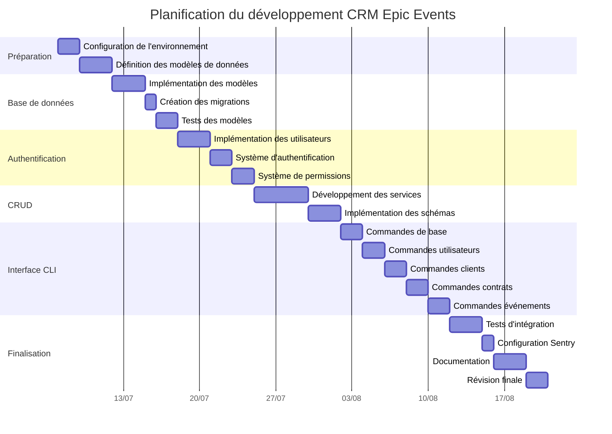
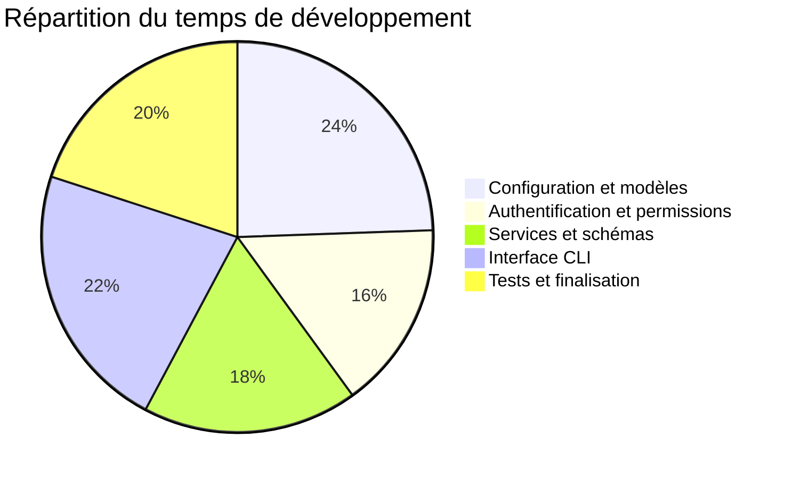

# Plan d'action pour le développement du CRM Epic Events

Ce document détaille le plan d'action pour le développement du système CRM Epic Events, en suivant les étapes clés recommandées pour ce projet.

## Vue d'ensemble du plan

## Détail des phases et tâches

### 1. Phase de préparation (5 jours)

#### 1.1 Configuration de l'environnement (2 jours)
- [x] Installer les dépendances requises (Python, PostgreSQL, etc.)
- [ ] Créer la structure du projet
- [ ] Configurer l'environnement de développement
- [ ] Mettre en place le système de gestion de version (Git)
- [ ] Configurer les outils de qualité de code (Black, Flake8, Mypy)

#### 1.2 Définition des modèles de données (3 jours)
- [ ] Analyser les exigences métier
- [ ] Concevoir le schéma de base de données (diagramme ER)
- [ ] Définir les relations entre les entités
- [ ] Documenter les modèles et leurs attributs

### 2. Phase de base de données (6 jours)

#### 2.1 Implémentation des modèles (3 jours)
- [ ] Créer les classes de modèles avec SQLAlchemy
- [ ] Implémenter les relations entre modèles
- [ ] Configurer la connexion à la base de données
- [ ] Gérer les variables d'environnement pour la configuration

#### 2.2 Création des migrations (1 jour)
- [ ] Configurer Alembic pour les migrations
- [ ] Créer la migration initiale
- [ ] Tester l'application des migrations
- [ ] Créer un script d'initialisation de base de données

#### 2.3 Tests des modèles (2 jours)
- [ ] Écrire des tests unitaires pour les modèles
- [ ] Tester les relations entre modèles
- [ ] Vérifier les contraintes d'intégrité
- [ ] Mettre en place une base de données de test

### 3. Phase d'authentification (7 jours)

#### 3.1 Implémentation des utilisateurs (3 jours)
- [ ] Créer le modèle utilisateur avec les rôles
- [ ] Implémenter le hachage sécurisé des mots de passe
- [ ] Développer les fonctions de création et validation d'utilisateur
- [ ] Tester les fonctionnalités utilisateur

#### 3.2 Système d'authentification (2 jours)
- [ ] Mettre en place l'authentification par JWT
- [ ] Gérer la création et validation des tokens
- [ ] Implémenter le stockage local des tokens
- [ ] Tester les fonctionnalités d'authentification

#### 3.3 Système de permissions (2 jours)
- [ ] Définir la matrice de permissions par rôle
- [ ] Créer les décorateurs de vérification de permissions
- [ ] Implémenter les restrictions d'accès basées sur les rôles
- [ ] Tester les permissions avec différents rôles

### 4. Phase de développement des opérations CRUD (8 jours)

#### 4.1 Développement des services (5 jours)
- [ ] Implémenter le service d'utilisateurs
- [ ] Implémenter le service de clients
- [ ] Implémenter le service de contrats
- [ ] Implémenter le service d'événements
- [ ] Développer les fonctions de filtrage et tri

#### 4.2 Implémentation des schémas (3 jours)
- [ ] Créer les schémas Pydantic pour la validation des données
- [ ] Implémenter les validations spécifiques
- [ ] Gérer les conversions entre modèles et schémas
- [ ] Tester les validations avec des données valides et invalides

### 5. Phase de développement de l'interface CLI (10 jours)

#### 5.1 Commandes de base (2 jours)
- [ ] Configurer Typer pour la CLI
- [ ] Créer la structure de commandes
- [ ] Implémenter les commandes d'aide et de version
- [ ] Configurer Rich pour l'affichage formaté

#### 5.2 Commandes utilisateurs (2 jours)
- [ ] Implémenter les commandes d'authentification
- [ ] Développer les commandes de gestion des utilisateurs
- [ ] Gérer les permissions pour ces commandes
- [ ] Tester les commandes utilisateurs

#### 5.3 Commandes clients (2 jours)
- [ ] Implémenter les commandes de gestion des clients
- [ ] Développer les fonctionnalités de filtrage
- [ ] Gérer les permissions pour ces commandes
- [ ] Tester les commandes clients

#### 5.4 Commandes contrats (2 jours)
- [ ] Implémenter les commandes de gestion des contrats
- [ ] Développer les fonctionnalités de filtrage
- [ ] Gérer les permissions pour ces commandes
- [ ] Tester les commandes contrats

#### 5.5 Commandes événements (2 jours)
- [ ] Implémenter les commandes de gestion des événements
- [ ] Développer les fonctionnalités de filtrage
- [ ] Gérer les permissions pour ces commandes
- [ ] Tester les commandes événements

### 6. Phase de finalisation (9 jours)

#### 6.1 Tests d'intégration (3 jours)
- [ ] Développer des tests d'intégration complets
- [ ] Tester les flux utilisateur typiques
- [ ] Vérifier la couverture de code
- [ ] Corriger les bugs identifiés

#### 6.2 Configuration Sentry (1 jour)
- [ ] Configurer l'intégration avec Sentry
- [ ] Mettre en place la journalisation des erreurs
- [ ] Tester la capture des exceptions
- [ ] Configurer les alertes

#### 6.3 Documentation (3 jours)
- [ ] Compléter la documentation du code
- [ ] Créer la documentation utilisateur
- [ ] Rédiger le schéma de la base de données
- [ ] Documenter le processus d'installation et de configuration

#### 6.4 Révision finale (2 jours)
- [ ] Effectuer une revue de code complète
- [ ] Optimiser les performances si nécessaire
- [ ] Vérifier la sécurité de l'application
- [ ] Préparer le dépôt GitHub pour la livraison

## Répartition du travail

La répartition du travail est estimée comme suit :

## Gestion des risques

| Risque | Probabilité | Impact | Mesure d'atténuation |
|--------|-------------|--------|----------------------|
| Retard dans le développement | Moyenne | Élevé | Prioriser les fonctionnalités essentielles, avoir des milestones hebdomadaires |
| Problèmes d'intégration entre composants | Moyenne | Moyen | Développer de manière itérative, tester régulièrement l'intégration |
| Difficultés avec l'authentification CLI | Élevée | Moyen | Consacrer plus de temps à cette partie, rechercher des solutions existantes |
| Bugs dans la gestion des permissions | Moyenne | Élevé | Tester minutieusement avec différents rôles, implémenter des tests automatisés |
| Problèmes de performance | Faible | Moyen | Surveiller les performances dès le début, optimiser les requêtes SQL |

## Suivi de progression

Pour suivre la progression du développement, nous utiliserons :

1. **Milestones GitHub** : Pour marquer les étapes importantes
2. **Issues GitHub** : Pour suivre les tâches spécifiques
3. **Pull Requests** : Pour la revue de code et l'intégration des fonctionnalités
4. **Tableaux Kanban** : Pour visualiser l'avancement des tâches

## Critères de succès

Le projet sera considéré comme réussi si :

1. Toutes les fonctionnalités requises sont implémentées
2. L'application est sécurisée et respecte les bonnes pratiques
3. La couverture de tests est d'au moins 80%
4. La documentation est complète et claire
5. L'interface CLI est intuitive et fonctionnelle
6. Les performances sont acceptables pour un usage quotidien
7. La journalisation avec Sentry est opérationnelle

## Ressources nécessaires

- **Environnement de développement** : Python 3.9+, PostgreSQL, SQLite
- **Dépendances externes** : SQLAlchemy, Typer, Rich, Pydantic, Passlib, PyJWT
- **Outils de qualité** : Black, Flake8, Mypy
- **Tests** : Pytest, Coverage
- **Documentation** : Markdown, diagrammes Mermaid
- **CI/CD** : GitHub Actions
- **Monitoring** : Sentry

## Livrables finaux

1. Code source complet sur GitHub
2. Schéma de la base de données
3. Documentation complète
4. Guide d'installation et d'utilisation
5. Tests automatisés
6. Intégration avec Sentry
