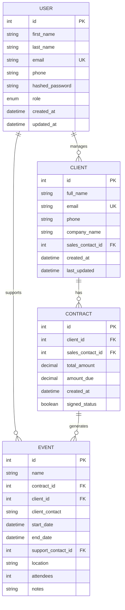

# Schéma de la Base de Données

Ce document présente le schéma de la base de données du CRM Epic Events sous différentes formes pour faciliter la compréhension de la structure des données.

## Diagramme Entité-Relation



## Schéma SQL

Voici le schéma SQL équivalent pour la création des tables :

```sql
-- Table des utilisateurs
CREATE TABLE users (
    id SERIAL PRIMARY KEY,
    first_name VARCHAR(50) NOT NULL,
    last_name VARCHAR(50) NOT NULL,
    email VARCHAR(100) UNIQUE NOT NULL,
    phone VARCHAR(20),
    hashed_password VARCHAR(100) NOT NULL,
    role VARCHAR(10) NOT NULL CHECK (role IN ('SALES', 'SUPPORT', 'MANAGEMENT')),
    created_at TIMESTAMP NOT NULL DEFAULT CURRENT_TIMESTAMP,
    updated_at TIMESTAMP NOT NULL DEFAULT CURRENT_TIMESTAMP
);

-- Table des clients
CREATE TABLE clients (
    id SERIAL PRIMARY KEY,
    full_name VARCHAR(100) NOT NULL,
    email VARCHAR(100) UNIQUE NOT NULL,
    phone VARCHAR(20) NOT NULL,
    company_name VARCHAR(100) NOT NULL,
    sales_contact_id INTEGER NOT NULL,
    created_at TIMESTAMP NOT NULL DEFAULT CURRENT_TIMESTAMP,
    last_updated TIMESTAMP NOT NULL DEFAULT CURRENT_TIMESTAMP,
    FOREIGN KEY (sales_contact_id) REFERENCES users (id)
);

-- Table des contrats
CREATE TABLE contracts (
    id SERIAL PRIMARY KEY,
    client_id INTEGER NOT NULL,
    sales_contact_id INTEGER NOT NULL,
    total_amount DECIMAL(15, 2) NOT NULL,
    amount_due DECIMAL(15, 2) NOT NULL,
    created_at TIMESTAMP NOT NULL DEFAULT CURRENT_TIMESTAMP,
    signed_status BOOLEAN NOT NULL DEFAULT FALSE,
    FOREIGN KEY (client_id) REFERENCES clients (id),
    FOREIGN KEY (sales_contact_id) REFERENCES users (id)
);

-- Table des événements
CREATE TABLE events (
    id SERIAL PRIMARY KEY,
    name VARCHAR(100) NOT NULL,
    contract_id INTEGER NOT NULL,
    client_id INTEGER NOT NULL,
    client_contact TEXT NOT NULL,
    start_date TIMESTAMP NOT NULL,
    end_date TIMESTAMP NOT NULL,
    support_contact_id INTEGER,
    location TEXT NOT NULL,
    attendees INTEGER NOT NULL,
    notes TEXT,
    FOREIGN KEY (contract_id) REFERENCES contracts (id),
    FOREIGN KEY (client_id) REFERENCES clients (id),
    FOREIGN KEY (support_contact_id) REFERENCES users (id)
);

-- Indices pour améliorer les performances
CREATE INDEX idx_user_email ON users (email);
CREATE INDEX idx_client_sales_contact ON clients (sales_contact_id);
CREATE INDEX idx_contract_client ON contracts (client_id);
CREATE INDEX idx_event_support_contact ON events (support_contact_id);
CREATE INDEX idx_event_contract ON events (contract_id);
```

## Modèles SQLAlchemy

```python
# Base model
from sqlalchemy.ext.declarative import declarative_base
from sqlalchemy import Column, Integer, DateTime
from sqlalchemy.sql import func

Base = declarative_base()

class BaseModel(Base):
    __abstract__ = True
    
    id = Column(Integer, primary_key=True, autoincrement=True)
    created_at = Column(DateTime, default=func.now(), nullable=False)

# User model
from sqlalchemy import Column, String, Enum, DateTime, ForeignKey
from sqlalchemy.orm import relationship
from sqlalchemy.sql import func

class User(BaseModel):
    __tablename__ = "users"
    
    first_name = Column(String(50), nullable=False)
    last_name = Column(String(50), nullable=False)
    email = Column(String(100), unique=True, nullable=False)
    phone = Column(String(20))
    hashed_password = Column(String(100), nullable=False)
    role = Column(Enum("SALES", "SUPPORT", "MANAGEMENT", name="user_roles"), nullable=False)
    updated_at = Column(DateTime, default=func.now(), onupdate=func.now(), nullable=False)
    
    # Relations
    clients = relationship("Client", back_populates="sales_contact")
    events = relationship("Event", back_populates="support_contact")

# Client model
class Client(BaseModel):
    __tablename__ = "clients"
    
    full_name = Column(String(100), nullable=False)
    email = Column(String(100), unique=True, nullable=False)
    phone = Column(String(20), nullable=False)
    company_name = Column(String(100), nullable=False)
    sales_contact_id = Column(Integer, ForeignKey("users.id"), nullable=False)
    last_updated = Column(DateTime, default=func.now(), onupdate=func.now(), nullable=False)
    
    # Relations
    sales_contact = relationship("User", back_populates="clients")
    contracts = relationship("Contract", back_populates="client")

# Contract model
from sqlalchemy import Boolean, Numeric

class Contract(BaseModel):
    __tablename__ = "contracts"
    
    client_id = Column(Integer, ForeignKey("clients.id"), nullable=False)
    sales_contact_id = Column(Integer, ForeignKey("users.id"), nullable=False)
    total_amount = Column(Numeric(15, 2), nullable=False)
    amount_due = Column(Numeric(15, 2), nullable=False)
    signed_status = Column(Boolean, default=False, nullable=False)
    
    # Relations
    client = relationship("Client", back_populates="contracts")
    sales_contact = relationship("User")
    events = relationship("Event", back_populates="contract")

# Event model
from sqlalchemy import Text

class Event(BaseModel):
    __tablename__ = "events"
    
    name = Column(String(100), nullable=False)
    contract_id = Column(Integer, ForeignKey("contracts.id"), nullable=False)
    client_id = Column(Integer, ForeignKey("clients.id"), nullable=False)
    client_contact = Column(Text, nullable=False)
    start_date = Column(DateTime, nullable=False)
    end_date = Column(DateTime, nullable=False)
    support_contact_id = Column(Integer, ForeignKey("users.id"))
    location = Column(Text, nullable=False)
    attendees = Column(Integer, nullable=False)
    notes = Column(Text)
    
    # Relations
    contract = relationship("Contract", back_populates="events")
    client = relationship("Client")
    support_contact = relationship("User", back_populates="events")
```

## Règles d'intégrité

### Contraintes de clé étrangère

1. `clients.sales_contact_id` référence `users.id`
2. `contracts.client_id` référence `clients.id`
3. `contracts.sales_contact_id` référence `users.id`
4. `events.contract_id` référence `contracts.id`
5. `events.client_id` référence `clients.id`
6. `events.support_contact_id` référence `users.id`

### Contraintes d'intégrité fonctionnelle

1. L'utilisateur référencé par `clients.sales_contact_id` doit avoir le rôle "SALES"
2. L'utilisateur référencé par `events.support_contact_id` doit avoir le rôle "SUPPORT"
3. Un événement ne peut être créé que si le contrat associé est signé (`contracts.signed_status = True`)
4. La date de fin d'un événement (`events.end_date`) doit être ultérieure à sa date de début (`events.start_date`)
5. Le montant restant à payer d'un contrat (`contracts.amount_due`) ne doit pas dépasser le montant total (`contracts.total_amount`)

## Migration de la base de données

Les migrations de la base de données sont gérées avec Alembic, qui est intégré à SQLAlchemy :

```python
# crm/migrations/env.py
from alembic import context
from sqlalchemy import engine_from_config, pool

from crm.config import settings
from crm.models import Base

# Configuration Alembic
config = context.config
config.set_main_option("sqlalchemy.url", settings.DATABASE_URL)
target_metadata = Base.metadata

# Fonction de migration
def run_migrations():
    connectable = engine_from_config(
        config.get_section(config.config_ini_section),
        prefix="sqlalchemy.",
        poolclass=pool.NullPool,
    )
    
    with connectable.connect() as connection:
        context.configure(
            connection=connection,
            target_metadata=target_metadata,
            render_as_batch=True,
        )
        
        with context.begin_transaction():
            context.run_migrations()
```

La migration initiale créera toutes les tables définies dans les modèles, avec leurs contraintes et relations.
