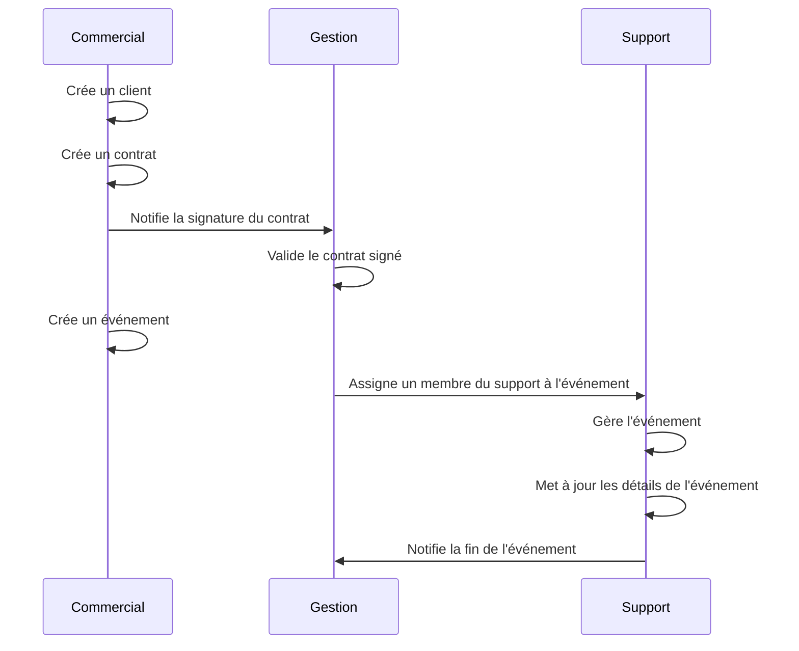
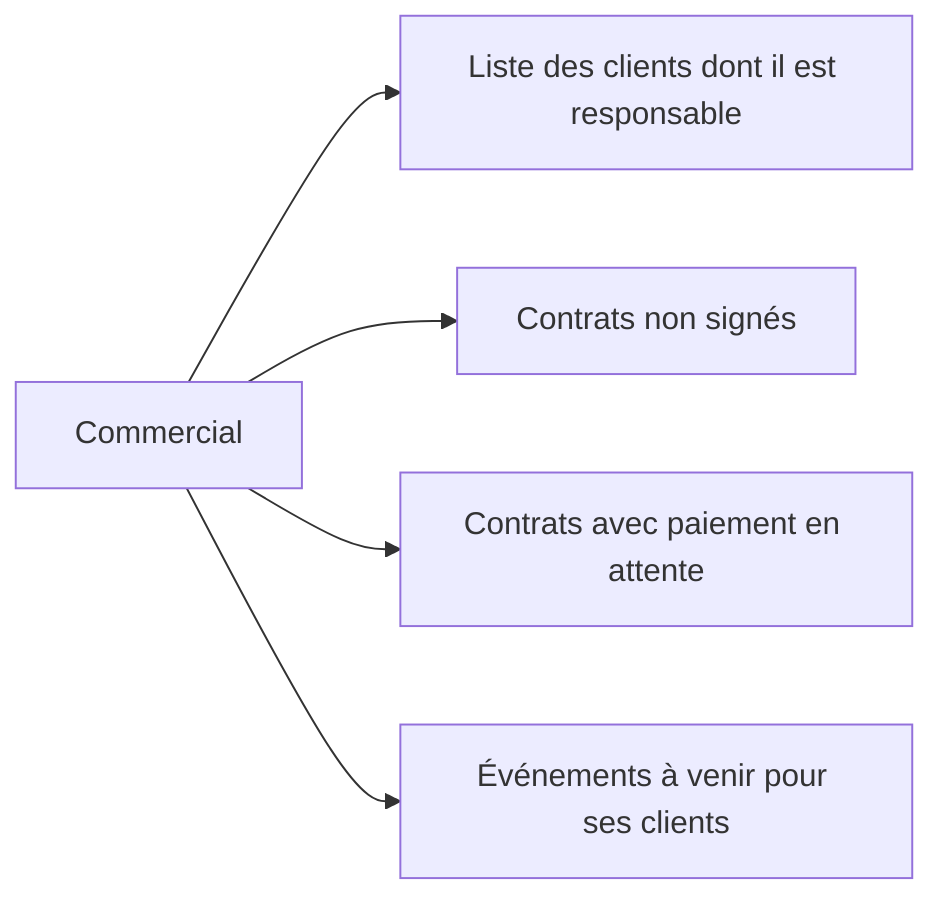
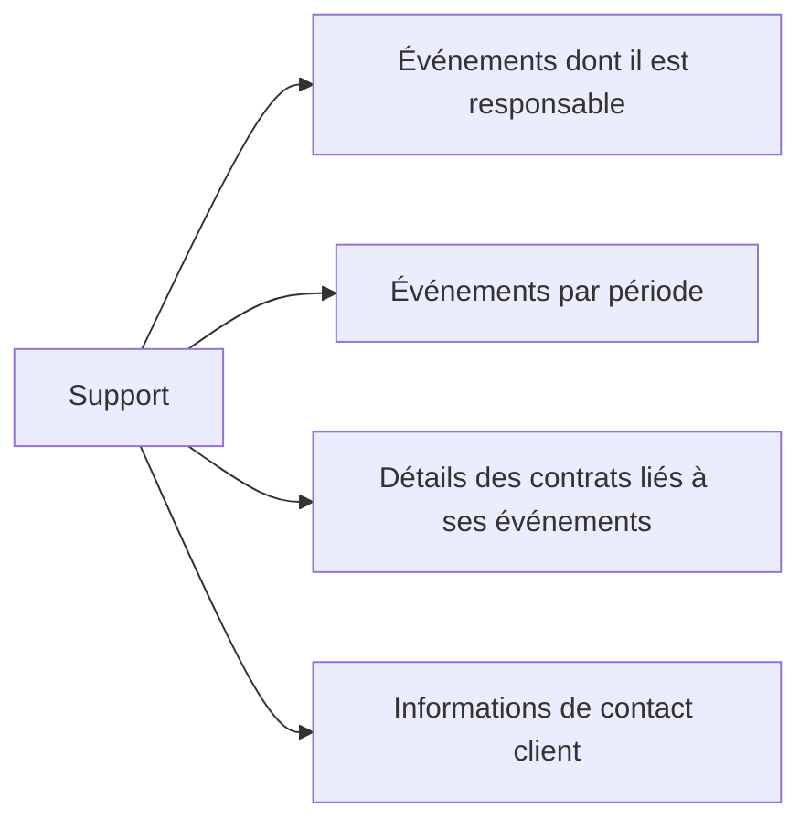
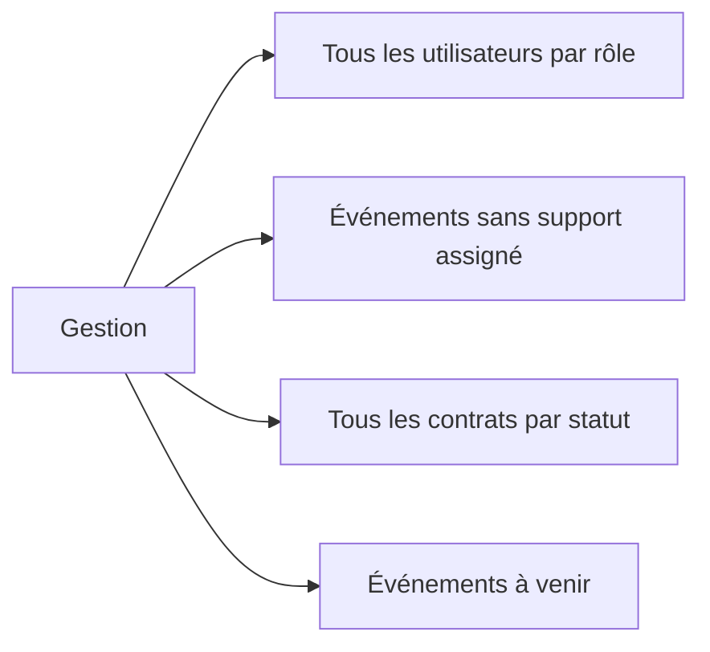

# Spécifications Fonctionnelles

Ce document détaille les spécifications fonctionnelles du CRM Epic Events, décrivant les besoins des utilisateurs et les fonctionnalités du système.

## 1. Profils utilisateurs

Le CRM Epic Events distingue trois profils utilisateurs correspondant aux trois départements de l'entreprise.

### 1.1. Utilisateur Commercial (SALES)

**Rôle** : Gestion des relations clients et des contrats associés.

**Responsabilités** :
- Démarcher de nouveaux clients
- Créer et mettre à jour les profils clients
- Créer des contrats pour les clients
- Suivre l'état des paiements des contrats
- Créer des événements pour les contrats signés

**Droits spécifiques** :
- Création de nouveaux clients (qui lui sont automatiquement associés)
- Modification des informations des clients dont il est responsable
- Création et modification des contrats de ses clients
- Création d'événements pour les contrats signés de ses clients

### 1.2. Utilisateur Support (SUPPORT)

**Rôle** : Organisation et gestion des événements.

**Responsabilités** :
- Assurer la préparation et le bon déroulement des événements
- Mettre à jour les informations relatives aux événements
- Suivre l'avancement des événements

**Droits spécifiques** :
- Consultation de tous les clients et contrats (lecture seule)
- Consultation de tous les événements
- Modification des détails des événements dont il est responsable

### 1.3. Utilisateur Gestion (MANAGEMENT)

**Rôle** : Administration globale du système CRM.

**Responsabilités** :
- Gérer les utilisateurs du système
- Superviser les contrats et les événements
- Assigner des membres du support aux événements

**Droits spécifiques** :
- Création, modification et suppression d'utilisateurs
- Accès complet à toutes les données (clients, contrats, événements)
- Création et modification de tous les contrats
- Attribution des événements aux membres du support

## 2. Fonctionnalités détaillées

### 2.1. Gestion des utilisateurs

#### 2.1.1. Authentification
- Connexion par email et mot de passe
- Stockage sécurisé des mots de passe (hachage + sel)
- Gestion des sessions par JWT (JSON Web Tokens)
- Déconnexion explicite

#### 2.1.2. Administration des utilisateurs (MANAGEMENT)
- Création de nouveaux comptes utilisateurs
- Attribution d'un rôle (SALES, SUPPORT, MANAGEMENT)
- Modification des informations utilisateur
- Désactivation/Suppression de comptes

### 2.2. Gestion des clients

#### 2.2.1. Création de clients (SALES)
- Saisie des informations du client :
  - Nom complet
  - Email (unique)
  - Téléphone
  - Nom de l'entreprise
- Association automatique au commercial créateur

#### 2.2.2. Consultation des clients
- Consultation de tous les clients (tous les rôles)
- Filtrage et tri des clients selon différents critères :
  - Par commercial responsable
  - Par nom/email/entreprise (recherche textuelle)
  - Par date de création/dernière mise à jour

#### 2.2.3. Mise à jour des clients
- Modification des informations client par le commercial responsable ou la gestion
- Journalisation des modifications

### 2.3. Gestion des contrats

#### 2.3.1. Création de contrats
- Par le département commercial pour ses clients
- Par le département gestion pour tout client
- Informations requises :
  - Client associé
  - Montant total
  - Montant restant à payer
  - Statut de signature

#### 2.3.2. Consultation des contrats
- Consultation de tous les contrats (tous les rôles)
- Filtrage des contrats :
  - Par client
  - Par statut de signature (signés/non signés)
  - Par statut de paiement (entièrement payés/partiellement payés)

#### 2.3.3. Mise à jour des contrats
- Modification par le commercial responsable ou la gestion
- Mise à jour du statut de signature
- Mise à jour du montant restant à payer

### 2.4. Gestion des événements

#### 2.4.1. Création d'événements
- Par le commercial pour ses contrats signés
- Par la gestion pour tout contrat signé
- Informations requises :
  - Nom de l'événement
  - Contrat associé (doit être signé)
  - Contact client
  - Dates de début et fin
  - Lieu
  - Nombre de participants
  - Notes éventuelles

#### 2.4.2. Consultation des événements
- Consultation de tous les événements (tous les rôles)
- Filtrage des événements :
  - Par client
  - Par membre du support responsable
  - Par période (aujourd'hui, semaine, mois)
  - Événements sans support assigné (gestion)

#### 2.4.3. Attribution des événements
- Par la gestion uniquement
- Assignation d'un membre du département support à un événement

#### 2.4.4. Mise à jour des événements
- Par le support responsable ou la gestion
- Mise à jour des informations logistiques
- Ajout de notes de suivi

## 3. Cas d'utilisation principaux

### 3.1. Cycle de vie client-contrat-événement

### 3.2. Filtrage des données selon les besoins

#### Commercial

#### Support

#### Gestion

## 4. Règles métier

### 4.1. Gestion des clients
- Un client est toujours associé à un commercial (contact commercial)
- Un commercial ne peut modifier que les informations des clients dont il est responsable

### 4.2. Gestion des contrats
- Un contrat est toujours associé à un client existant
- Le statut de signature doit être explicitement défini (signé/non signé)
- Le montant restant à payer ne peut pas dépasser le montant total du contrat

### 4.3. Gestion des événements
- Un événement ne peut être créé que si le contrat associé est signé
- La date de fin de l'événement doit être postérieure à sa date de début
- Un événement doit avoir un lieu et un nombre de participants définis

### 4.4. Permissions utilisateurs
- Seul le département MANAGEMENT peut créer, modifier ou supprimer des utilisateurs
- Un commercial ne peut voir et modifier que ses propres clients et leurs contrats associés
- Un support ne peut modifier que les événements dont il est responsable
- Tout utilisateur peut consulter la liste des clients, contrats et événements (lecture seule)

## 5. Exigences non fonctionnelles

### 5.1. Performances
- Temps de réponse du système inférieur à 2 secondes pour les opérations courantes
- Capacité à gérer simultanément plusieurs dizaines d'utilisateurs

### 5.2. Sécurité
- Stockage sécurisé des mots de passe (hachage + sel)
- Protection contre les injections SQL
- Journalisation des actions sensibles
- Application du principe du moindre privilège

### 5.3. Fiabilité
- Journalisation des erreurs avec Sentry
- Sauvegarde régulière des données
- Gestion appropriée des erreurs

### 5.4. Utilisabilité
- Interface en ligne de commande intuitive avec aide contextuelle
- Retour d'information clair sur les actions effectuées
- Documentation utilisateur complète

## 6. Contraintes

### 6.1. Technologiques
- Application en ligne de commande (CLI)
- Développée en Python 3.9+
- Base de données SQL (SQLite en développement, PostgreSQL en production)
- Intégration avec Sentry pour la journalisation

### 6.2. Organisationnelles
- Livraison dans un délai de deux mois
- Utilisation des bonnes pratiques de développement et de sécurité
- Code source publié sur GitHub
