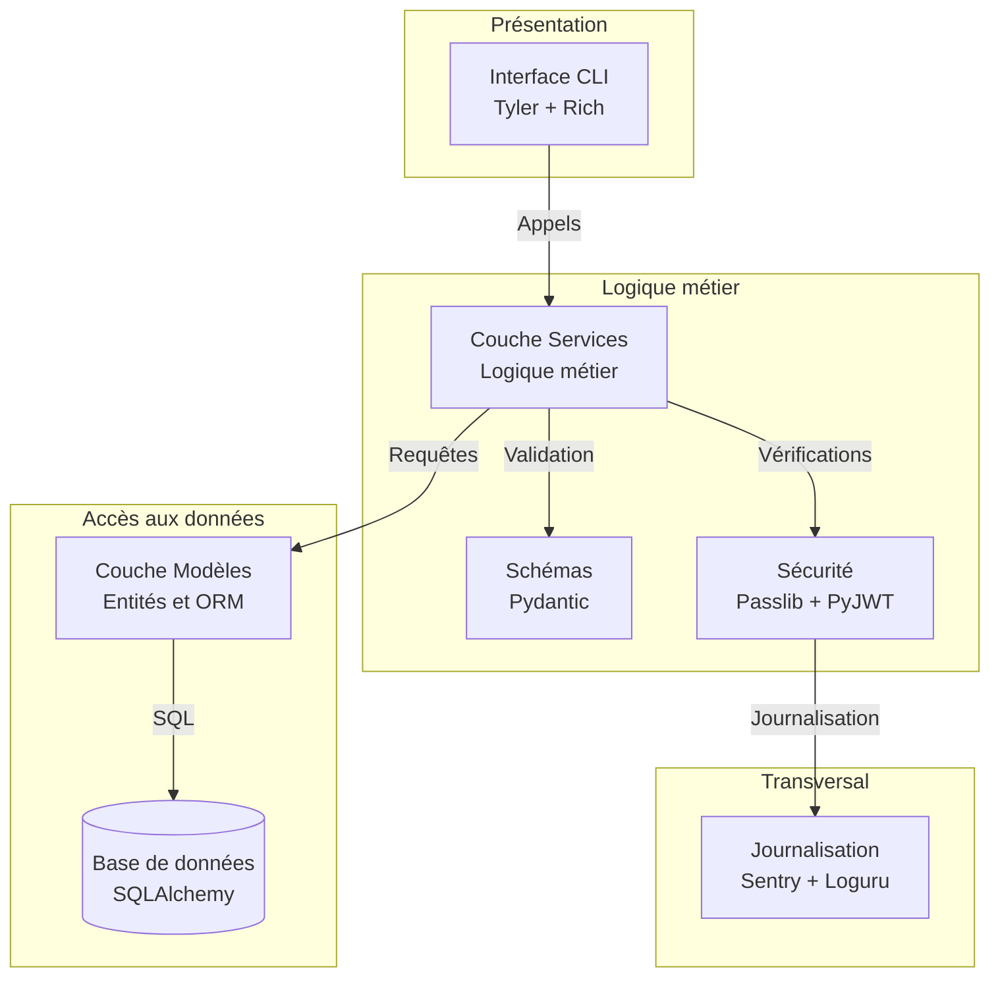
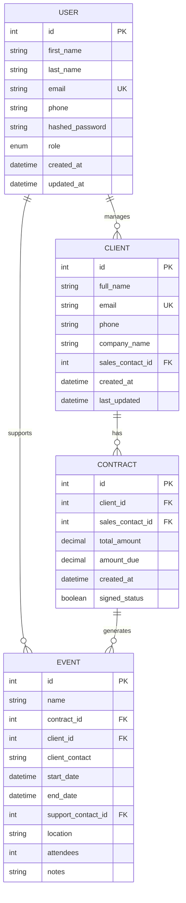
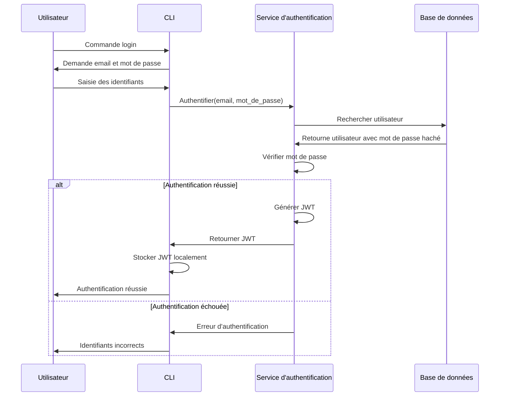
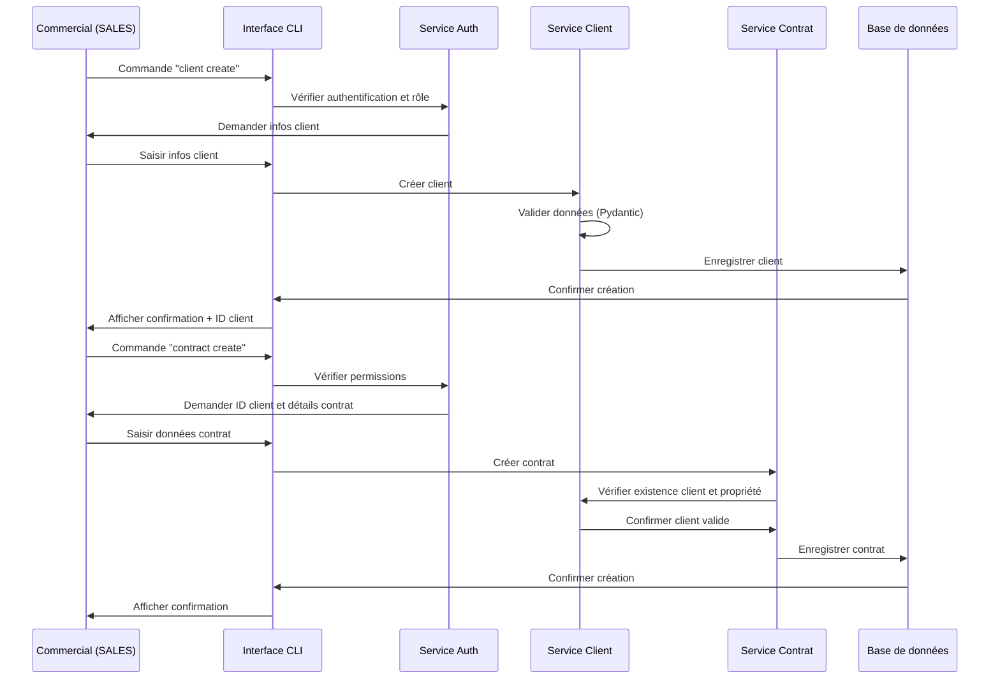
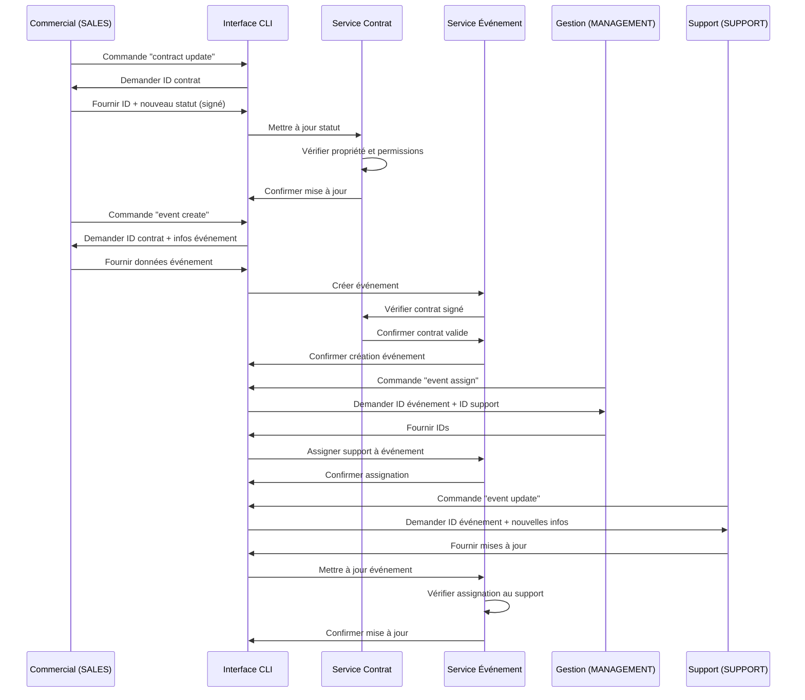
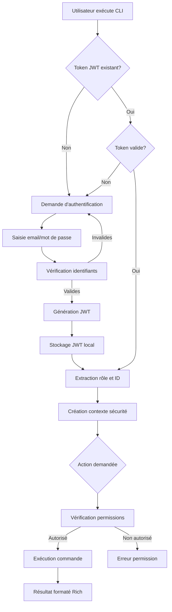

# Spécifications Techniques

Ce document détaille les spécifications techniques du CRM Epic Events, décrivant l'architecture, les choix technologiques et les aspects techniques du développement.

## 1. Architecture globale

### 1.1. Architecture en couches

Le CRM Epic Events est conçu selon une architecture en couches qui sépare clairement les responsabilités :



### 1.2. Modèle de données

Le modèle de données est centré autour de quatre entités principales avec leurs relations :



### 1.3. Flux d'authentification



## 2. Technologies et dépendances

### 2.1. Stack technique

| Composant | Technologie | Version | Description |
|-----------|-------------|---------|-------------|
| Langage de programmation | Python | 3.9+ | Langage principal du projet |
| ORM | SQLAlchemy | 1.4.x | Mapping objet-relationnel pour l'accès à la base de données |
| Migrations | Alembic | 1.8.x | Gestion des migrations de base de données |
| CLI | Typer | 0.7.x | Framework pour la création d'interfaces en ligne de commande |
| Interface utilisateur | Rich | 12.6.x | Bibliothèque pour les sorties terminal enrichies |
| Validation de données | Pydantic | 1.10.x | Validation et sérialisation des données |
| Hachage de mots de passe | Passlib | 1.7.x | Bibliothèque pour le hachage sécurisé |
| Authentification | PyJWT | 2.6.x | Gestion des tokens JWT |
| Journalisation | Sentry SDK | 1.13.x | Suivi des erreurs |
| Journalisation locale | Loguru | 0.6.x | Journalisation enrichie |
| Variables d'environnement | python-dotenv | 0.21.x | Gestion des variables d'environnement |
| Base de données (dev) | SQLite | 3.x | Base de données pour le développement |
| Base de données (prod) | PostgreSQL | 14.x | Base de données pour la production |

### 2.2. Structure du projet

```
crm_epic_events/
├── .env.example               # Exemple de configuration des variables d'environnement
├── .gitignore                 # Fichiers à ignorer par Git
├── README.md                  # Documentation du projet
├── requirements.txt           # Dépendances du projet
├── setup.py                   # Configuration du package
├── conftest.py                # Configuration des tests pytest
├── crm/
│   ├── __init__.py
│   ├── config.py              # Configuration de l'application
│   ├── models/                # Modèles SQLAlchemy
│   │   ├── __init__.py
│   │   ├── base.py           # Classe de base pour les modèles
│   │   ├── user.py           # Modèle utilisateur
│   │   ├── client.py         # Modèle client
│   │   ├── contract.py       # Modèle contrat
│   │   └── event.py          # Modèle événement
│   ├── database.py            # Configuration SQLAlchemy
│   ├── schemas/               # Schémas Pydantic
│   │   ├── __init__.py
│   │   ├── user.py
│   │   ├── client.py
│   │   ├── contract.py
│   │   └── event.py
│   ├── services/              # Logique métier
│   │   ├── __init__.py
│   │   ├── auth.py
│   │   ├── client.py
│   │   ├── contract.py
│   │   └── event.py
│   ├── security/              # Fonctions de sécurité
│   │   ├── __init__.py
│   │   ├── auth.py           # Authentification
│   │   └── permissions.py     # Système de permissions
│   └── utils/                 # Utilitaires
│       ├── __init__.py
│       ├── logging.py         # Configuration de Loguru et Sentry
│       └── helpers.py         # Fonctions d'aide générales
├── cli/                       # Interface en ligne de commande
│   ├── __init__.py
│   ├── main.py                # Point d'entrée CLI (avec Typer)
│   ├── commands/              # Commandes de la CLI
│   │   ├── __init__.py
│   │   ├── auth_commands.py
│   │   ├── client_commands.py
│   │   ├── contract_commands.py
│   │   └── event_commands.py
│   └── formatters/            # Formatage des sorties avec Rich
│       ├── __init__.py
│       ├── tables.py
│       └── styles.py
└── tests/                     # Tests
    ├── __init__.py
    ├── conftest.py            # Configuration des fixtures
    ├── unit/                  # Tests unitaires
    └── integration/           # Tests d'intégration
```

## 3. Implémentations techniques spécifiques

### 3.1. Base de données et ORM

#### 3.1.1. Configuration de la connexion

```python
# crm/database.py
import os
from sqlalchemy import create_engine
from sqlalchemy.ext.declarative import declarative_base
from sqlalchemy.orm import sessionmaker
from dotenv import load_dotenv

# Charger les variables d'environnement
load_dotenv()

# URL de la base de données depuis les variables d'environnement
DATABASE_URL = os.getenv("DATABASE_URL", "sqlite:///./epic_events.db")

# Créer le moteur SQLAlchemy avec les options appropriées
engine = create_engine(
    DATABASE_URL,
    connect_args={"check_same_thread": False} if DATABASE_URL.startswith("sqlite") else {},
    echo=False,  # Mettre à True pour le débogage SQL
)

# Créer une classe de session
SessionLocal = sessionmaker(autocommit=False, autoflush=False, bind=engine)
```

#### 3.1.2. Migrations avec Alembic

Les migrations de base de données sont gérées par Alembic, intégré à SQLAlchemy. Le workflow de migration comprend :

1. Autogénération des migrations basées sur les changements de modèles :
   ```bash
   alembic revision --autogenerate -m "description_migration"
   ```

2. Application des migrations :
   ```bash
   alembic upgrade head
   ```

3. Retour en arrière si nécessaire :
   ```bash
   alembic downgrade -1
   ```

### 3.2. Sécurité

#### 3.2.1. Hachage des mots de passe

```python
# crm/security/auth.py
from passlib.context import CryptContext

# Configuration de l'algorithme de hachage bcrypt
pwd_context = CryptContext(schemes=["bcrypt"], deprecated="auto")

def hash_password(password: str) -> str:
    """Hache un mot de passe en texte brut"""
    return pwd_context.hash(password)

def verify_password(plain_password: str, hashed_password: str) -> bool:
    """Vérifie qu'un mot de passe correspond à sa version hachée"""
    return pwd_context.verify(plain_password, hashed_password)
```

#### 3.2.2. Gestion des JWT

```python
# crm/security/auth.py
import os
import jwt
from datetime import datetime, timedelta
from typing import Dict, Optional

# Configuration JWT
SECRET_KEY = os.getenv("SECRET_KEY")
ALGORITHM = "HS256"
ACCESS_TOKEN_EXPIRE_MINUTES = int(os.getenv("ACCESS_TOKEN_EXPIRE_MINUTES", "1440"))

def create_access_token(data: Dict, expires_delta: Optional[timedelta] = None) -> str:
    """Crée un JWT avec les données spécifiées et une date d'expiration"""
    to_encode = data.copy()
    expire = datetime.utcnow() + (expires_delta or timedelta(minutes=ACCESS_TOKEN_EXPIRE_MINUTES))
    to_encode.update({"exp": expire})
    encoded_jwt = jwt.encode(to_encode, SECRET_KEY, algorithm=ALGORITHM)
    return encoded_jwt

def decode_token(token: str) -> Dict:
    """Décode un JWT et retourne ses données"""
    try:
        payload = jwt.decode(token, SECRET_KEY, algorithms=[ALGORITHM])
        return payload
    except jwt.PyJWTError as e:
        raise Exception(f"Token invalide: {str(e)}")
```

#### 3.2.3. Système de permissions

Le système de permissions est basé sur les rôles (RBAC - Role-Based Access Control) avec des vérifications additionnelles sur la propriété des ressources.

```python
# crm/security/permissions.py
from enum import Enum
from typing import List, Optional, Dict, Any
from functools import wraps

class Role(str, Enum):
    SALES = "SALES"
    SUPPORT = "SUPPORT"
    MANAGEMENT = "MANAGEMENT"

class Permission(str, Enum):
    READ = "read"
    CREATE = "create"
    UPDATE = "update"
    DELETE = "delete"

# Matrice de permissions par rôle et ressource
PERMISSIONS = {
    Role.MANAGEMENT: {
        "user": [Permission.READ, Permission.CREATE, Permission.UPDATE, Permission.DELETE],
        "client": [Permission.READ, Permission.CREATE, Permission.UPDATE, Permission.DELETE],
        "contract": [Permission.READ, Permission.CREATE, Permission.UPDATE, Permission.DELETE],
        "event": [Permission.READ, Permission.CREATE, Permission.UPDATE, Permission.DELETE],
    },
    Role.SALES: {
        "user": [Permission.READ],
        "client": [Permission.READ, Permission.CREATE, Permission.UPDATE],  # Uniquement ses clients
        "contract": [Permission.READ, Permission.CREATE, Permission.UPDATE],  # Uniquement les contrats de ses clients
        "event": [Permission.READ, Permission.CREATE],  # Création pour contrats signés
    },
    Role.SUPPORT: {
        "user": [Permission.READ],
        "client": [Permission.READ],
        "contract": [Permission.READ],
        "event": [Permission.READ, Permission.UPDATE],  # Uniquement ses événements
    }
}
```

### 3.3. Interface CLI avec Typer

```python
# cli/main.py
import typer
from cli.commands import auth_commands, client_commands, contract_commands, event_commands, user_commands

# Création de l'application Typer
app = typer.Typer(
    name="epic-events",
    help="Système CRM pour Epic Events",
    add_completion=True,
)

# Ajout des sous-commandes
app.add_typer(auth_commands.app, name="auth", help="Gestion de l'authentification")
app.add_typer(user_commands.app, name="user", help="Gestion des utilisateurs")
app.add_typer(client_commands.app, name="client", help="Gestion des clients")
app.add_typer(contract_commands.app, name="contract", help="Gestion des contrats")
app.add_typer(event_commands.app, name="event", help="Gestion des événements")

# Point d'entrée
if __name__ == "__main__":
    app()
```

#### Exemple de commande de login

```python
# cli/commands/auth_commands.py
import typer
import os
from rich import print
from rich.prompt import Prompt, Password
from crm.services.auth import authenticate_user
from crm.security.token_storage import save_token

app = typer.Typer()

@app.command("login")
def login():
    """Se connecter au système CRM"""
    print("[bold blue]Connexion au CRM Epic Events[/bold blue]")
    
    email = Prompt.ask("Email")
    password = Password.ask("Mot de passe")
    
    try:
        token = authenticate_user(email, password)
        save_token(token)
        print("[bold green]Connexion réussie ![/bold green]")
    except Exception as e:
        print(f"[bold red]Erreur de connexion : {str(e)}[/bold red]")
        raise typer.Exit(code=1)
```

### 3.4. Validation des données avec Pydantic

```python
# crm/schemas/client.py
from pydantic import BaseModel, EmailStr, validator, constr
from typing import Optional
from datetime import datetime

class ClientBase(BaseModel):
    full_name: constr(min_length=1, max_length=100)
    email: EmailStr
    phone: constr(min_length=5, max_length=20)
    company_name: constr(min_length=1, max_length=100)

class ClientCreate(ClientBase):
    pass

class ClientUpdate(BaseModel):
    full_name: Optional[constr(min_length=1, max_length=100)] = None
    email: Optional[EmailStr] = None
    phone: Optional[constr(min_length=5, max_length=20)] = None
    company_name: Optional[constr(min_length=1, max_length=100)] = None
    
    @validator('email')
    def email_must_not_be_empty_if_provided(cls, v):
        if v == "":
            raise ValueError('email cannot be empty string')
        return v

class ClientInDB(ClientBase):
    id: int
    sales_contact_id: int
    created_at: datetime
    last_updated: datetime
    
    class Config:
        orm_mode = True
```

### 3.5. Journalisation avec Sentry et Loguru

```python
# crm/utils/logging.py
import os
import sentry_sdk
from loguru import logger
from sentry_sdk.integrations.sqlalchemy import SqlalchemyIntegration

# Configuration de Sentry
sentry_sdk.init(
    dsn=os.getenv("SENTRY_DSN"),
    environment=os.getenv("SENTRY_ENVIRONMENT", "development"),
    integrations=[
        SqlalchemyIntegration(),
    ],
    traces_sample_rate=1.0,
    send_default_pii=True,
)

# Configuration de Loguru
LOG_LEVEL = os.getenv("LOG_LEVEL", "INFO")

# Supprimer le gestionnaire par défaut
logger.remove()

# Ajouter des gestionnaires personnalisés
logger.add(
    "logs/info.log",
    level="INFO",
    rotation="10 MB",
    retention="1 week",
    format="{time:YYYY-MM-DD at HH:mm:ss} | {level} | {message}",
)

logger.add(
    "logs/error.log",
    level="ERROR",
    rotation="10 MB",
    retention="1 month",
    format="{time:YYYY-MM-DD at HH:mm:ss} | {level} | {name}:{function}:{line} | {message}",
)

# Ajouter le gestionnaire de console
logger.add(
    lambda msg: print(msg),
    level=LOG_LEVEL,
    format="<green>{time:YYYY-MM-DD HH:mm:ss}</green> | <level>{level}</level> | <cyan>{name}</cyan>:<cyan>{function}</cyan>:<cyan>{line}</cyan> - <level>{message}</level>",
    colorize=True,
)
```

## 4. Sécurité et protection des données

### 4.1. Stratégie de sécurité

La stratégie de sécurité du CRM Epic Events s'articule autour de plusieurs axes :

1. **Protection des données d'authentification**
   - Hachage des mots de passe avec bcrypt
   - Utilisation de JWT avec une date d'expiration
   - Stockage sécurisé des tokens JWT

2. **Contrôle d'accès**
   - Système de permissions basé sur les rôles (RBAC)
   - Principe du moindre privilège
   - Vérification de la propriété des ressources

3. **Protection contre les attaques courantes**
   - Validation des entrées avec Pydantic
   - Utilisation de requêtes paramétrées (via SQLAlchemy)
   - Protection contre les injections SQL

4. **Journalisation et audit**
   - Suivi des erreurs avec Sentry
   - Journalisation locale avec Loguru
   - Enregistrement des actions sensibles

### 4.2. Mesures de protection contre les injections SQL

Les injections SQL sont évitées grâce à l'utilisation de l'ORM SQLAlchemy, qui paramétrise automatiquement les requêtes :

```python
# Exemple de requête sécurisée avec SQLAlchemy
def get_client_by_email(db, email: str):
    return db.query(Client).filter(Client.email == email).first()
```

### 4.3. Gestion des secrets

Les secrets et informations sensibles sont gérés via des variables d'environnement :

- Clé secrète pour les JWT
- Chaîne de connexion à la base de données
- DSN Sentry
- Autres configurations sensibles

Un fichier `.env` est utilisé en développement et les variables d'environnement sont configurées directement sur l'environnement en production.

## 5. Tests

### 5.1. Stratégie de tests

La stratégie de tests du CRM Epic Events comprend :

1. **Tests unitaires** pour les composants individuels
2. **Tests d'intégration** pour les interactions entre composants
3. **Tests fonctionnels** pour les scénarios utilisateur complets

### 5.2. Configuration de pytest

```python
# conftest.py
import os
import pytest
from sqlalchemy import create_engine
from sqlalchemy.orm import sessionmaker
from sqlalchemy.pool import StaticPool

from crm.models.base import Base
from crm.database import get_db, SessionLocal


@pytest.fixture(scope="session")
def test_db_engine():
    """Crée un moteur de base de données pour les tests"""
    engine = create_engine(
        "sqlite:///:memory:",
        connect_args={"check_same_thread": False},
        poolclass=StaticPool,
    )
    Base.metadata.create_all(bind=engine)
    return engine


@pytest.fixture(scope="function")
def db_session(test_db_engine):
    """Crée une session de base de données pour les tests"""
    TestingSessionLocal = sessionmaker(
        autocommit=False, autoflush=False, bind=test_db_engine
    )
    session = TestingSessionLocal()
    try:
        yield session
    finally:
        session.rollback()
        session.close()
```

### 5.3. Exemple de test unitaire

```python
# tests/unit/test_auth.py
import pytest
from crm.security.auth import hash_password, verify_password, create_access_token, decode_token

def test_password_hashing():
    password = "secure_password123"
    hashed = hash_password(password)
    
    # Le hash doit être différent du mot de passe original
    assert hashed != password
    # La vérification doit fonctionner avec le bon mot de passe
    assert verify_password(password, hashed) is True
    # La vérification doit échouer avec un mauvais mot de passe
    assert verify_password("wrong_password", hashed) is False

def test_jwt_token():
    data = {"sub": "test@example.com", "role": "SALES"}
    token = create_access_token(data)
    
    # Le token doit être une chaîne non vide
    assert isinstance(token, str)
    assert len(token) > 0
    
    # Le décodage doit retourner les données originales
    decoded = decode_token(token)
    assert decoded["sub"] == data["sub"]
    assert decoded["role"] == data["role"]
    assert "exp" in decoded  # Le token doit avoir une date d'expiration
```

## 6. Déploiement

### 6.1. Environnement de développement

Pour le développement, le CRM utilise :
- SQLite comme base de données
- Des variables d'environnement locales via `.env`
- Des outils de développement (black, flake8, mypy)

### 6.2. Environnement de production

Pour la production, le CRM utilisera :
- PostgreSQL comme base de données
- Variables d'environnement configurées sur le serveur
- Supervision avec Sentry

### 6.3. Processus de déploiement

1. Préparation
   - Tests complets
   - Vérification de la qualité du code
   - Génération de la documentation

2. Déploiement
   - Installation des dépendances
   - Configuration des variables d'environnement
   - Migration de la base de données
   - Configuration de la supervision

3. Post-déploiement
   - Vérifications fonctionnelles
   - Création d'un utilisateur administratif initial
   - Formation des utilisateurs

### 6.4. Sauvegarde et récupération

Pour assurer la sécurité des données :
- Sauvegardes quotidiennes de la base de données
- Conservation des sauvegardes pendant au moins 30 jours
- Procédure de restauration documentée et testée

## 7. Implémentation détaillée des modèles

### 7.1. Modèle User

```python
# crm/models/user.py
from sqlalchemy import Column, Integer, String, Enum, DateTime, func
from sqlalchemy.orm import relationship

from crm.models.base import Base
from crm.security.permissions import Role

class User(Base):
    __tablename__ = "users"
    
    id = Column(Integer, primary_key=True, index=True)
    first_name = Column(String(50), nullable=False)
    last_name = Column(String(50), nullable=False)
    email = Column(String(100), unique=True, nullable=False, index=True)
    phone = Column(String(20), nullable=True)
    hashed_password = Column(String(255), nullable=False)
    role = Column(Enum(Role), nullable=False)
    created_at = Column(DateTime, default=func.now())
    updated_at = Column(DateTime, default=func.now(), onupdate=func.now())
    
    # Relationships
    clients = relationship("Client", back_populates="sales_contact")
    contracts = relationship("Contract", back_populates="sales_contact")
    events = relationship("Event", back_populates="support_contact")
    
    def __repr__(self):
        return f"<User {self.email}>"
```

### 7.2. Modèle Client

```python
# crm/models/client.py
from sqlalchemy import Column, Integer, String, DateTime, ForeignKey, func
from sqlalchemy.orm import relationship

from crm.models.base import Base

class Client(Base):
    __tablename__ = "clients"
    
    id = Column(Integer, primary_key=True, index=True)
    full_name = Column(String(100), nullable=False)
    email = Column(String(100), unique=True, nullable=False, index=True)
    phone = Column(String(20), nullable=False)
    company_name = Column(String(100), nullable=False)
    sales_contact_id = Column(Integer, ForeignKey("users.id"), nullable=False)
    created_at = Column(DateTime, default=func.now())
    last_updated = Column(DateTime, default=func.now(), onupdate=func.now())
    
    # Relationships
    sales_contact = relationship("User", back_populates="clients")
    contracts = relationship("Contract", back_populates="client", cascade="all, delete-orphan")
    events = relationship("Event", back_populates="client", cascade="all, delete-orphan")
    
    def __repr__(self):
        return f"<Client {self.full_name} ({self.company_name})>"
```

### 7.3. Modèle Contract

```python
# crm/models/contract.py
from sqlalchemy import Column, Integer, Numeric, Boolean, DateTime, ForeignKey, func
from sqlalchemy.orm import relationship

from crm.models.base import Base

class Contract(Base):
    __tablename__ = "contracts"
    
    id = Column(Integer, primary_key=True, index=True)
    client_id = Column(Integer, ForeignKey("clients.id"), nullable=False)
    sales_contact_id = Column(Integer, ForeignKey("users.id"), nullable=False)
    total_amount = Column(Numeric(10, 2), nullable=False)
    amount_due = Column(Numeric(10, 2), nullable=False)
    created_at = Column(DateTime, default=func.now())
    signed_status = Column(Boolean, default=False)
    
    # Relationships
    client = relationship("Client", back_populates="contracts")
    sales_contact = relationship("User", back_populates="contracts")
    events = relationship("Event", back_populates="contract", cascade="all, delete-orphan")
    
    def __repr__(self):
        status = "Signé" if self.signed_status else "Non signé"
        return f"<Contract #{self.id} - {status} - {self.total_amount}>"
```

### 7.4. Modèle Event

```python
# crm/models/event.py
from sqlalchemy import Column, Integer, String, DateTime, ForeignKey, Text
from sqlalchemy.orm import relationship

from crm.models.base import Base

class Event(Base):
    __tablename__ = "events"
    
    id = Column(Integer, primary_key=True, index=True)
    name = Column(String(100), nullable=False)
    contract_id = Column(Integer, ForeignKey("contracts.id"), nullable=False)
    client_id = Column(Integer, ForeignKey("clients.id"), nullable=False)
    client_contact = Column(String(100), nullable=False)
    start_date = Column(DateTime, nullable=False)
    end_date = Column(DateTime, nullable=False)
    support_contact_id = Column(Integer, ForeignKey("users.id"), nullable=True)
    location = Column(String(200), nullable=False)
    attendees = Column(Integer, nullable=False)
    notes = Column(Text, nullable=True)
    
    # Relationships
    contract = relationship("Contract", back_populates="events")
    client = relationship("Client", back_populates="events")
    support_contact = relationship("User", back_populates="events")
    
    def __repr__(self):
        return f"<Event {self.name} - {self.start_date.strftime('%Y-%m-%d')}>"
```

## 8. Flux d'opérations détaillés

### 8.1. Création d'un client et d'un contrat



### 8.2. Mise à jour du statut d'un contrat et création d'un événement



### 8.3. Processus d'authentification et gestion des JWT


